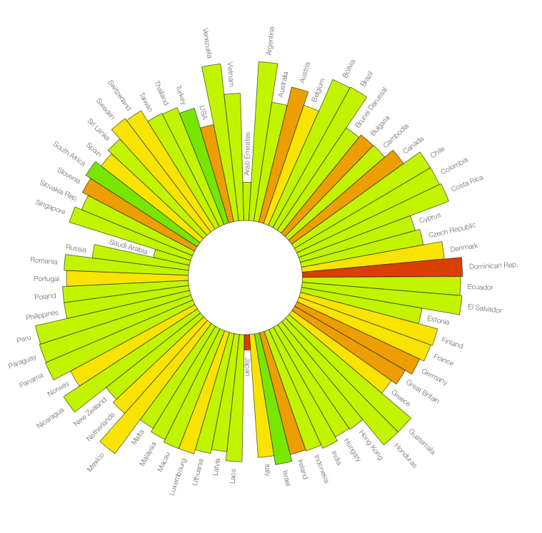

D3 Sunburst
===========

This is one of my first experiments with D3.

I wanted to create a sunburst that shows relative volume by the length of each burst. Color indicates a second dimension. Each burst has a label that is positioned on the outside.

